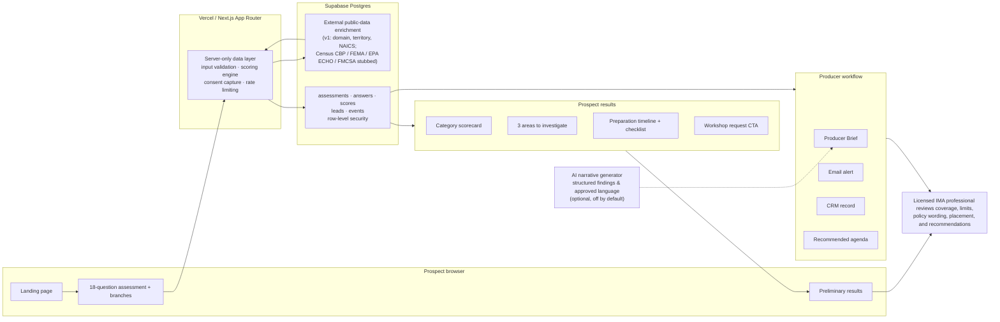

# MVP architecture

Mirrors Figure 1 of the product plan ("Recommended MVP architecture"). Deterministic scoring and sensitive operations stay server-side, public-data signals enrich the assessment, and a licensed IMA professional remains the gate for formal insurance advice.

## Box-to-code map

| Diagram box | Implementation | Status |
|---|---|---|
| Landing page | `src/app/page.tsx` | Built |
| 18-question assessment | `src/components/AssessmentFlow.tsx`, `src/lib/diagnostic/questions.ts` (18 core + 7 branched) | Built |
| Preliminary results | `src/app/results/[token]/page.tsx` (shown before any email ask) | Built |
| Vercel / Next.js App Router | `src/app`, `next.config.ts` | Built |
| Input validation | `src/lib/validation/schemas.ts` (zod), `src/lib/server/http.ts` | Built |
| Scoring engine | `src/lib/diagnostic/scoring.ts`, `findings.ts`, `renewal.ts`, `checklist.ts` | Built, unit-tested |
| Consent capture | `src/lib/server/dal.ts` → `captureLead()`; `leads.consent_*` columns with versioned consent text | Built |
| Rate limiting | `src/lib/server/ratelimit.ts` (in-memory; swap for Redis when multi-instance) | Built |
| Supabase Postgres: assessments, answers, scores, leads, events | `supabase/migrations/0001_init.sql`, `src/lib/server/repo/supabase.ts` | Built |
| Row-level security | Same migration: anon denied, producers read + review-field update, trigger protects prospect columns | Built |
| External public-data enrichment | `src/lib/server/enrichment.ts` — v1 returns domain, territory, NAICS; `externalSignals()` is the hook for Census CBP, FEMA Risk Index, EPA ECHO, FMCSA, SEC/BLS | Stubbed (plan: build later) |
| AI narrative generator | `src/lib/server/ai.ts` — plain-English summary of structured findings for the Producer Brief only; prospect-facing copy comes from the approved findings library without AI | Built, optional |
| Category scorecard | `ScoreMeter` in `src/components/ui.tsx` on the results page and PDF | Built |
| 3 areas to investigate | `generateFindings()` | Built |
| Preparation timeline | Renewal timing vs. 120-day runway + preparation checklist (unlocked by email) | Built |
| Book a workshop CTA | Workshop request checkbox at email capture; flagged to producer. No calendar integration yet | Built (request, not booking) |
| Briefing summary | `src/lib/brief/producerBrief.ts`, page at `/producer/leads/[id]`, JSON/Markdown via `/api/producer/brief` | Built |
| Email alert | `producerAlertEmail()` in `src/lib/server/email.ts` | Built |
| CRM record | `src/lib/server/crm.ts` signed webhook + CSV export | Built |
| Recommended agenda | `agenda` section of the Producer Brief | Built |
| Licensed professional review gate | `licensed_review_completed` + disposition on every lead; dashboard shows "Awaiting review" until set | Built |
